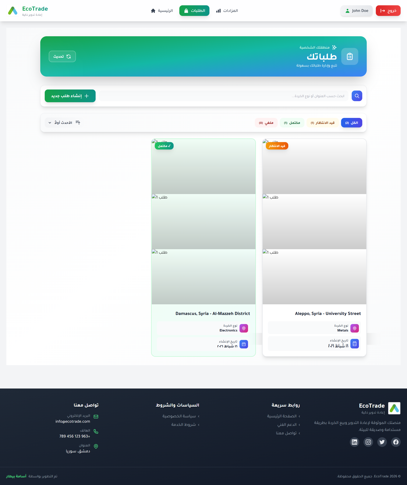
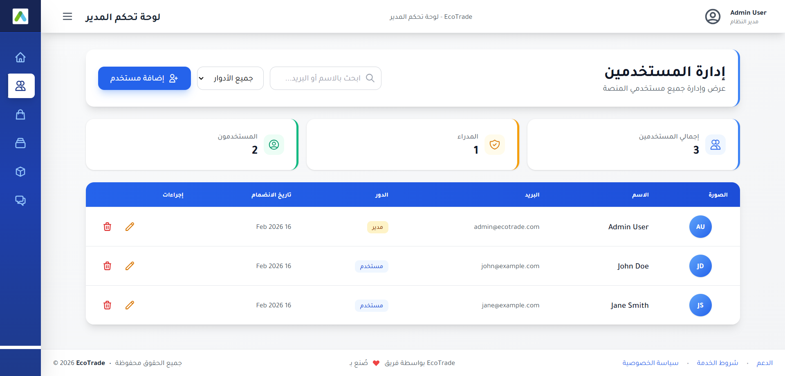
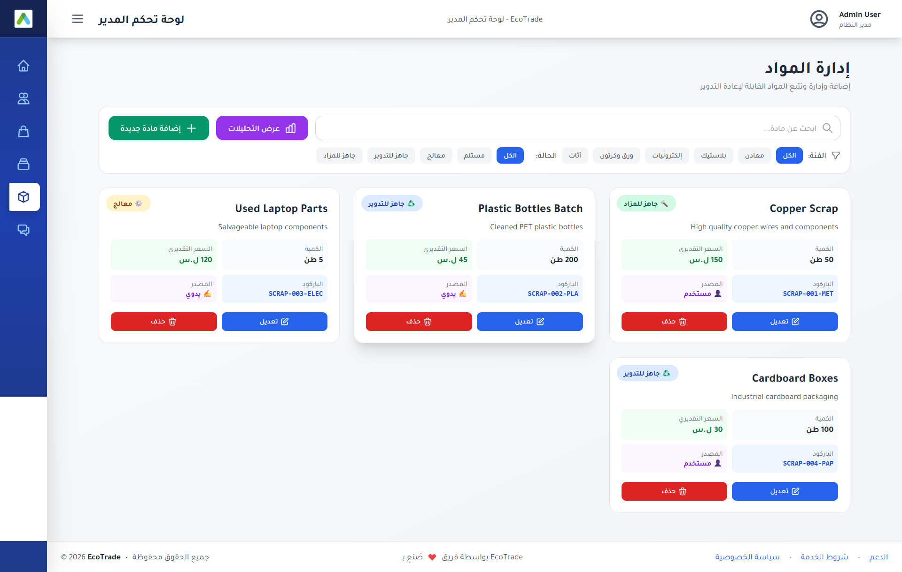
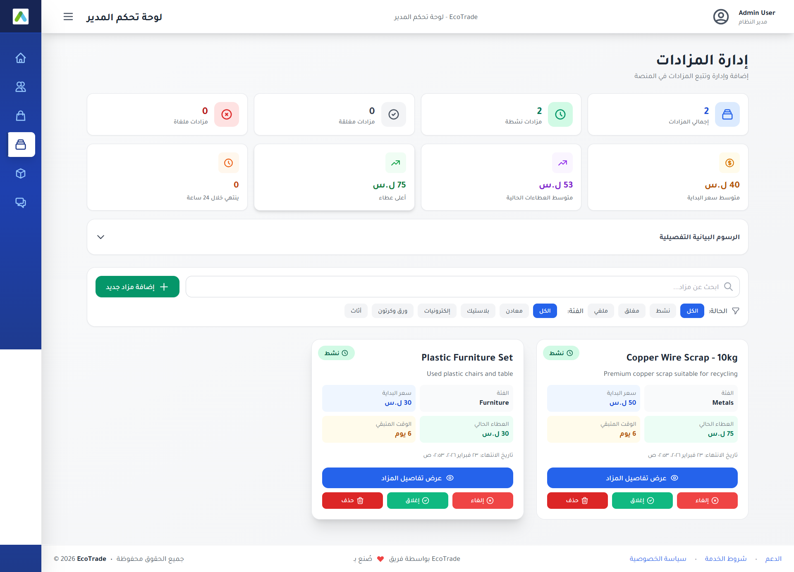
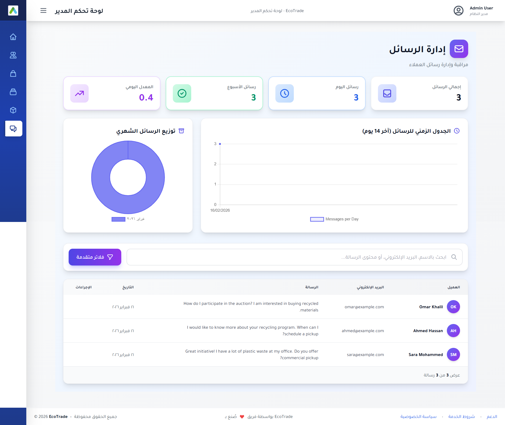
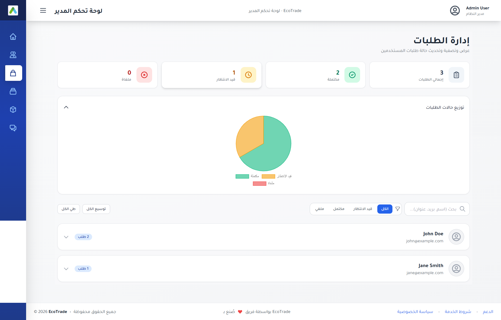

# EcoTrade

**A Digital Platform for Smart Recycling and Scrap Trading**

---

## ⚠️ IMPORTANT: Usage & License Notice

**This project is for PORTFOLIO AND DEMONSTRATION PURPOSES ONLY.**

- **No use without explicit permission:** This project, its code, design, and any associated assets **cannot be used under any circumstances** without the prior written consent of the author.
- **Showcase purpose:** The project is intended solely to demonstrate the software development capabilities and work methodology of the author as a software developer.
- **Exclusive authorization:** Any use—including but not limited to cloning, forking, modifying, deploying, or commercial use—**must be authorized exclusively by the author upon direct request.**
- **All rights reserved.**

---

## Introduction

EcoTrade addresses a fundamental gap in the recycling sector: the disconnect between those who possess recyclable materials—individuals, households, enterprises, and institutions—and those who wish to acquire them—recycling companies, scrap dealers, and investors. Often, these materials are discarded, stored, or left unused, leading to environmental, social, and economic losses.

EcoTrade acts as a bridge. It is a digital platform that connects supply and demand through two core mechanisms: **material collection requests** and **online auctions**. The goal is to transform recycling from a marginal activity into part of the formal economy, where materials are properly valued and all parties benefit.

---

## Vision and Philosophy

### Turning Waste into a Resource

The philosophy of EcoTrade rests on a simple principle: what is considered waste in one place can be a valuable resource elsewhere. Materials such as metals, plastics, electronics, paper and cardboard, and furniture are not merely "scrap" to be discarded—they are potential inputs for recycling and manufacturing processes.

### Connecting Environment and Economy

The project does not focus solely on the environmental dimension; it ties it to economic opportunity. When owners can sell what they have at a fair price and buyers can easily access what they need, sustainability becomes a viable, profitable choice rather than merely a charitable act.

### Core Values

| Value | Description |
|-------|-------------|
| **Transparency** | All bidders see the same information; price is determined through clear competition. |
| **Fairness** | There is no distinction between a factory owner and a small provider; anyone with usable materials can participate. |
| **Trust** | Traceable records for requests, materials, and bids; support channels for dispute resolution. |
| **Simplicity** | Register, submit a request or join an auction, then complete the transaction. |

---

## Strategic Objectives

1. **Creating a transparent and fair market** — Reducing fragmentation in the recycling sector; prices determined by actual demand rather than opaque dealings.
2. **Simplifying the disposal of recyclable materials** — Connecting individuals and small shops directly with collection and processing entities.
3. **Supporting the circular economy** — Facilitating the flow of materials from end consumers back into the production cycle.
4. **Promoting environmental awareness through economic benefit** — When individuals see they can earn from "waste," they become more willing to participate in recycling.

---

## Target Groups

- **Material Providers:** Individuals, enterprises, factories, shops, and institutions who own recyclable materials.
- **Material Buyers:** Recycling companies, scrap dealers, and investors seeking materials.
- **Administration:** Managers who oversee the full workflow—from receiving requests, classifying materials, running auctions, to coordinating delivery with winners.

---

## The Operational Flow

EcoTrade operates in four phases:

1. **Submission and Request** — A provider submits a request with location, material type, approximate quantity, and images. The request reaches the platform administration and is recorded.
2. **Collection and Classification** — The responsible entity collects and classifies materials into categories (metals, plastics, electronics, etc.) and tracks them through stages: received → processed → ready for recycling → ready for auction.
3. **The Auction** — When a batch is ready, an auction is opened with a starting price and end date. Bidders submit offers; the highest bidder wins when time expires.
4. **Completing the Transaction** — After the winner is declared, coordination takes place for collection or delivery, followed by payment and handover.

---

## The Platform in Action

### User Experience

Registered users interact with the platform through three main areas: requests, auctions, and the auction room. The interface is designed with a consistent visual identity—green-to-blue gradients, clean sections, and clear call-to-action buttons—to reinforce familiarity and ease of use.

#### 1. Requests Page (طلباتك)

Users submit and manage their material collection and recycling requests. They can search, filter by status (all, pending, completed, canceled), and create new requests. Each request includes location selection via an interactive map, scrap type, and supporting images. Status tracking and admin notes keep users informed throughout the process.

#### 2. Auctions Listing (المزادات)

Users browse available auctions, filter by status and category, search by item name, and switch between grid and list views. Each auction card shows images, status, time remaining, price information in euros, and statistics (views, participants, bids). Live statistics and countdown timers create urgency and support informed bidding decisions.

#### 3. Auction Room (غرفة المزاد)

The auction room displays full details: images, description, category, quantity, location, condition, weight, specifications, start price, current bid, and end date. Users see a live countdown, bid history, and can place new bids. When an auction closes, winner information is displayed. The design ensures transparency and reduces errors or disputes.

---

### Admin Experience

Administrators access a dedicated dashboard for oversight and management. Access is restricted to users with administrative privileges.

#### Main Dashboard

The entry point provides summary statistics (users, orders, auctions, materials, messages), visual breakdowns of order and auction status, and quick links to all management sections. This answers the fundamental question: *What is the current state of the platform?*

#### User Management

Administrators manage platform accounts: list users, filter by role (admin or regular user), search, add, edit, and delete accounts. This underpins security and access control.

#### Materials Management

The inventory of recyclable materials is managed here. Items are displayed with attributes such as name, description, category, quantity, estimated price, status, and source (user request or manual entry). Materials move through the workflow from receipt to auction readiness. Administrators can add, edit, delete, and analyze materials by category and status.

#### Auctions Management

Administrators create, cancel, close, and delete auctions. Each auction shows item details, images, prices, time remaining, and status. Filters by status and category support efficient prioritisation.

#### Messages Management

Customer inquiries and feedback from the contact form are centralised here. Administrators can view message details, search, filter by date, and monitor trends through analytics (e.g. messages over the last 14 days).

#### Orders / Requests Management

All material collection requests submitted by users are managed here. Administrators track status from submission through processing to completion or cancellation, view user information and request details, and ensure timely pickup and clear communication.

---

## Expected Impact

### Environmental

- Reducing waste that is dumped, burned, or landfilled.
- Saving energy and raw materials needed for new production.
- Contributing to lower carbon emissions.

### Economic

- Creating income opportunities for material providers.
- Providing competitively priced materials for processors and companies.
- Revitalising and improving the efficiency of the recycling market.

### Social

- Raising awareness of recycling through practical engagement.
- Encouraging cooperation between individuals, companies, and institutions.

---

## Conclusion

EcoTrade is not merely a platform for selling used materials; it is an initiative that sees recycling as an economic, environmental, and social opportunity combined. The core idea is to connect those who have reusable materials with those who seek them, while ensuring price transparency and fair competition through the auction system. In this way, the project transforms recycling into part of the formal economy, where materials are properly valued and everyone benefits: the seller, the buyer, and the environment.

---

*EcoTrade — Demonstrating sustainable recycling through a transparent, digital marketplace.*
